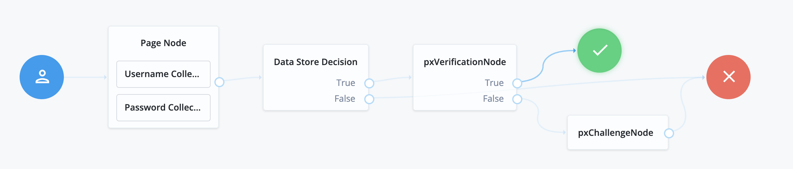
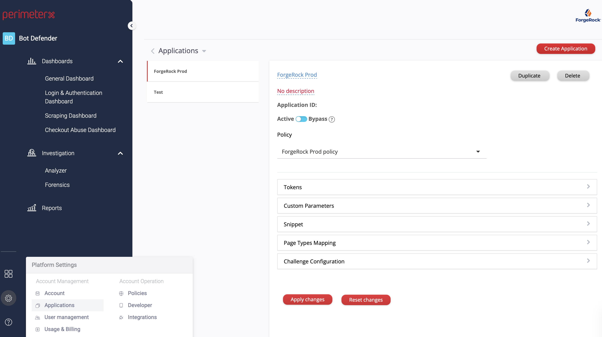
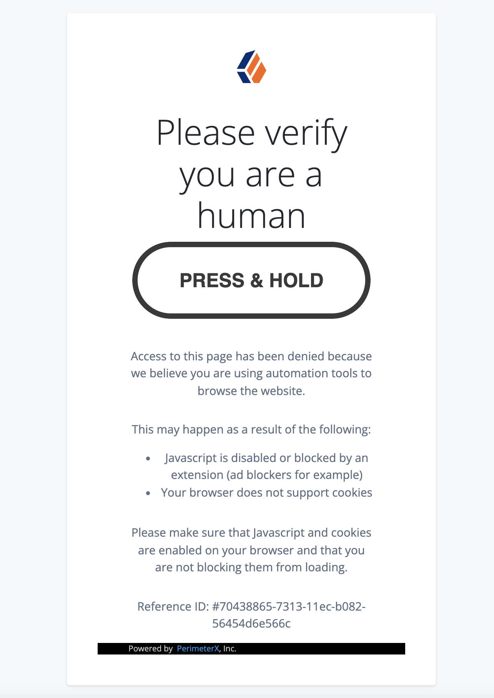

<!--
 * The contents of this file are subject to the terms of the Common Development and
 * Distribution License (the License). You may not use this file except in compliance with the
 * License.
 *
 * You can obtain a copy of the License at legal/CDDLv1.0.txt. See the License for the
 * specific language governing permission and limitations under the License.
 *
 * When distributing Covered Software, include this CDDL Header Notice in each file and include
 * the License file at legal/CDDLv1.0.txt. If applicable, add the following below the CDDL
 * Header, with the fields enclosed by brackets [] replaced by your own identifying
 * information: "Portions copyright [year] [name of copyright owner]".
 *
 * Copyright 2021 ForgeRock AS.
-->

# PerimeterX Authentication Nodes

PerimeterX Bot Defender nodes for [Identity Platform][forgerock_platform] 7.1.0 and above. Combined, the nodes handle the PerimeterX request verification process and the display of the challenge page.

## Installation

To deploy these nodes, download the jar from the releases tab on github
[here](https://github.com/PerimeterX/perimeterx-forgerock-nodes/releases). Next, copy the jar into the ../web-container/webapps/openam/WEB-INF/lib directory where AM is deployed. Restart the web container to pick up the new node. The node will then appear in the authentication trees components palette.

## Usage

Drag the node to your journey and connect it after the Data Store Decision node. Connect the `true` output to your success node and the `false` output to the **pxChallengeNode** in order to show the challenge page for a blocked request. Finally, connect **pxChallengeNode** to the red X:

Make sure to fill in the required node properties for the **pxVerificationNode** node. You can find all the required data on the [PerimeterX Console](https://console.perimeterx.com).

When a request gets blocked, the default challenge page will be shown, as follows:

# pxVerificationNode

PerimeterX Bot Defender node for [Identity Platform][forgerock_platform] 7.1.0 and above. Handles the PerimeterX request verification process.

### pxVerificationNode configuration

-   **PerimeterX Application ID -** Application ID to be retrieved from the PerimeterX console.
-   **PerimeterX Auth Token -** Auth Token to be retrieved from the PerimeterX console.
-   **PerimeterX Cookie Secret -** Cookie Secret to be retrieved from the PerimeterX console.
-   **PerimeterX Allowlist for User-Agents -** A list of User-Agents PerimeterX should always allow.
-   **PerimeterX Allowlist for IP addresses -** A list of IP addresses PerimeterX should always allow.
-   **PerimeterX Blocking Score -** The score of which PerimeterX module will block upon.
-   **PerimeterX Module Mode -** Sets the mode for the module: 0 is monitor, 1 is blocking.
-   **PerimeterX Server Connection Timeout -** The timeout (in ms) for connecting to PerimeterX servers.
-   **PerimeterX API Connection Timeout -** The timeout (in ms) for connecting to PerimeterX APIs.
-   **PerimeterX Sensitive Routes -** A list of route prefixes that are defined as sensitive.
-   **PerimeterX Bypass Monitor Header -** A header name which if sent - bypasses monitor mode for the specific request it was sent for.

# pxChallengeNode

PerimeterX Bot Defender node for [Identity Platform][forgerock_platform] 7.1.0 and above. Display of the challenge page.

### pxChallengeNode configuration

-   **PerimeterX CSS Referencing -** An absolute URL to a custom CSS file to use when showing the challenge page.
-   **PerimeterX JavaScript Ref -** An absolute URL to a custom JavaScript file to use when showing the challenge page. Can be used for customizing the challenge element look and feel.

## Notes

The code in this repository has binary dependencies that live in the ForgeRock maven repository. Maven can be configured to authenticate to this repository by following the following [ForgeRock Knowledge Base Article](https://backstage.forgerock.com/knowledge/kb/article/a74096897).

ForgeRock does not warrant, guarantee or make any representations regarding the use, results of use, accuracy, timeliness or completeness of any data or information relating to the sample code. ForgeRock disclaims all warranties, expressed or implied, and in particular, disclaims all warranties of merchantability, and warranties related to the code, or any service or software related thereto.

ForgeRock shall not be liable for any direct, indirect or consequential damages or costs of any type arising out of any action taken by you or others related to the sample code.

[forgerock_platform]: https://www.forgerock.com/platform/
